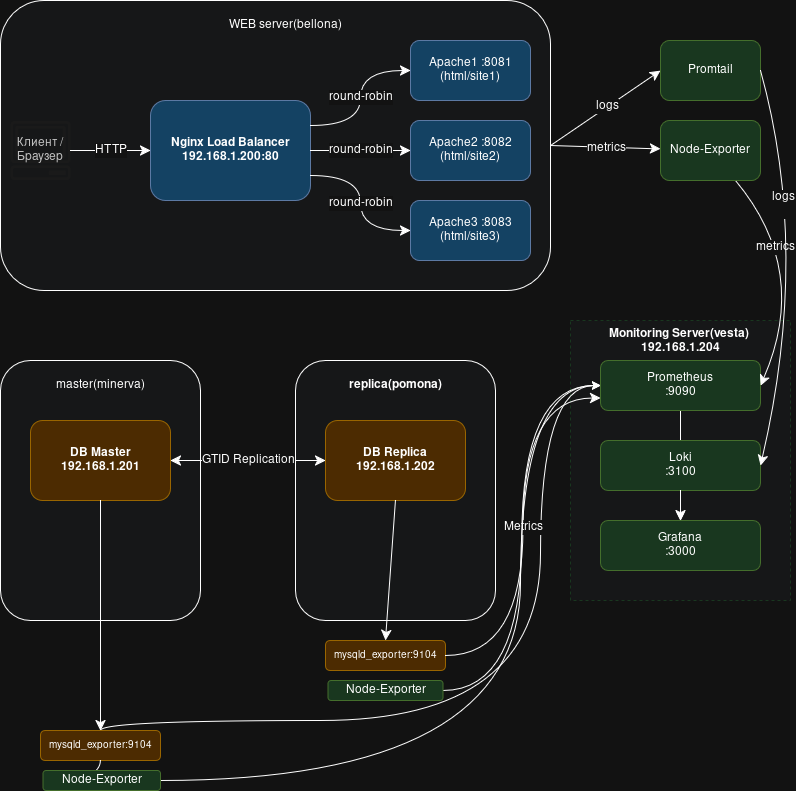

# Разработка и реализация DRP-решения для веб-стека с использованием Bash

**Цель проекта**  
Создать автоматизированную, отказоустойчивую систему с веб-сервером, балансировкой нагрузки, репликацией базы данных MariaDB, ежедневными бэкапами, централизованным мониторингом (метрики + логи) и планом аварийного восстановления.

Система развёртывается на 4 серверах (Proxmox LXC/VM):

- **WEB** (192.168.1.200) — Nginx + 3×PHP-Apache контейнера с round-robin балансировкой
- **DB Master** (192.168.1.201) — MariaDB master
- **DB Replica** (192.168.1.202) — MariaDB slave
- **Monitoring** (192.168.1.204) — Prometheus + Grafana + Loki + Promtail

**WEB** и **Monitoring** разворачиваются скриптом на соответствующих серверах
**База данных** разворачивается с любого пк, у которого настроен ssh/config с ключом к двум удаленным серверам

## Архитектура



## Функционал и особенности

- **Веб-слой** 
  - Nginx как reverse-proxy и load-balancer 
  - Сайт представляет собой демонстрацию работы балансировщика
  - 3 контейнера PHP-Apache (каждый со своей страницей) 
  - Балансировка round-robin 

- **База данных** 
  - MariaDB master-slave репликация через GTID (slave_pos) 
  - Автоматическая настройка пользователей, конфигов и репликации 
  - 5 сценариев поломки репликации + авто-восстановление 
  - Тестовая БД Sakila (импорт из дампа) 
  - Потабличный бэкап со slave (mysqldump + GTID-позиция) 
  
- **Мониторинг и логи** 
  - Prometheus + Grafana (метрики системы, Docker, MySQL, репликация) 
  - Loki + Promtail (логи Nginx, системные логи) 
  - Экспортеры: node_exporter, mysqld_exporter 
  - Автоматическое развёртывание агентов на всех серверах 

- **Автоматизация**
  - Скрипты проверяют зависимости, генерируют конфиги, запускают Docker Compose
  - Интерактивный `main.sh` для чистой установки и дальнейшего управления репликацией и бэкапами
  
  
## Как развернуть систему с нуля

1. **Подготовка**  
   - 4 чистых Ubuntu 24.04 сервера (Proxmox LXC/VM)
   - SSH-доступ по ключам от пользователя с sudo
   - настроить статические айпи для каждого из серверов
   - git clone https://github.com/AdrianLeVoir/otus_linux_basic_drp_project.git

2. **Мониторинг-сервер (192.168.1.204)**  
   ```bash
   cd metric
   ./setup.sh
   ```
      Grafana: http://192.168.1.204:3000
      Prometheus: http://192.168.1.204:9090
      
3. Веб-сервер (192.168.1.200)
   ```bash
   cd web
   ./setup.sh
   ```
   Сайт: http://192.168.1.200
   
4. БД Master (192.168.1.201) и БД Replica (192.168.1.202)
   - Скрипт действует удаленно, непосредственное ssh подключение к машинам не требуется
   ```bash
   cd sql 
   ./main.sh
   ```
## Тестирование отказоустойчивости
В main.sh (режим 3) доступны 5 сценариев поломки репликации + автоматическое восстановление.
    Использованные технологии

    ОС: Ubuntu 24.04
    Веб: Nginx + PHP-Apache (docker)
    БД: MariaDB 10.11+ (GTID репликация)
    Мониторинг: Prometheus, Grafana, Loki, Promtail
    Экспортеры: node_exporter, mysqld_exporter
    Автоматизация: bash-скрипты + Docker Compose
   
